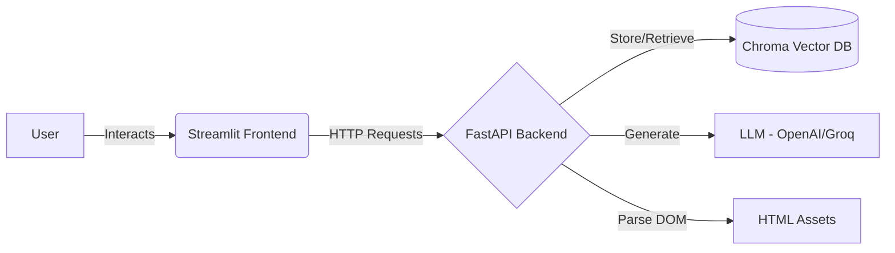

# 🧬 QA Cortex: Autonomous QA Agent


[](https://python.org)
[](https://fastapi.tiangolo.com)
[](https://streamlit.io)
[](https://www.docker.com/)
[](https://langchain.com)

> **"Stop writing repetitive test scripts. Let the AI do it."**

**QA Cortex** is an enterprise-grade AI agent designed to automate the initial phase of Software Testing. By ingesting product specifications, UI/UX guidelines, and raw HTML structures, it creates a "Thinking Knowledge Base." It then uses RAG (Retrieval Augmented Generation) to generate comprehensive test plans and writes runnable Python Selenium automation scripts for you.

Deployed Link: https://qualityassurance.streamlit.app

---

## 🚀 Key Features

* **🧠 Cognitive Knowledge Base:** Upload PDFs, Markdown, and HTML files. The agent creates a vector index isolated by user session.
* **🧪 AI Test Planning:** Generates positive, negative, and edge-case test scenarios based *strictly* on your uploaded documentation (No hallucinations).
* **🤖 Auto-Coding:** Converts plain-text test cases into fully functional **Python Selenium** scripts using the correct ID/CSS selectors from your HTML.
* **🔒 Session Isolation:** User data is clustered and isolated using UUIDs, preventing data leakage between sessions.
* **🐳 Dockerized:** Fully containerized architecture including a headless Chrome environment for backend execution.

---

## 🏗️ System Architecture

The project is built on a decoupled **Client-Server** architecture, fully containerized for deployment.



### Core Components

| Component | Tech Stack | Description |
| :--- | :--- | :--- |
| **Frontend** | Streamlit | A clean, reactive UI for file management and agent interaction. Handles session state automatically. |
| **Backend** | FastAPI | Async REST API. Manages the "Brains" (Agents), file uploads, and session isolation. |
| **Vector DB** | ChromaDB | Stores semantic embeddings of your documents. Isolated per user session. |
| **Automation** | Selenium | Used conceptually by the agent to understand DOM interactions and generate correct selectors. |
| **LLM** | OpenAI / Groq | The reasoning engine used for Test Planning and Code Generation. |

---

## ⚙️ Environment Configuration

Before running, create a `.env` file in the root directory.

```ini
# REQUIRED: Choose your LLM Provider
OPENAI_API_KEY=sk-proj-your-key-here...
# OR
GROQ_API_KEY=gsk_your_key_here...

# OPTIONAL: Backend Configuration
API_URL=http://backend:8000/api  # Used by Frontend in Docker
```

---

## 🛠️ Installation & Usage

### Method 1: Docker (Recommended) 🐳

The easiest way to run the full stack (Frontend + Backend + Chrome + Dependencies).

1. **Clone the repository:**

   ```bash
   git clone https://github.com/your-username/qa-cortex.git
   cd qa-cortex
   ```

2. **Configure Environment:**
   Ensure your `.env` file is created (see above).

3. **Run with Docker Compose:**

   ```bash
   docker-compose up --build
   ```

   *Wait for the logs to say "Uvicorn running" and "Streamlit running".*

4. **Access the App:**

   * **Frontend Dashboard:** http://localhost:8501
   * **Backend API Docs:** http://localhost:8000/docs

---

### Method 2: Manual Local Setup 💻

If you prefer running Python directly on your machine.

#### 1. Backend Setup

```bash
cd backend
python -m venv venv
source venv/bin/activate  # Windows: venv\Scripts\activate
pip install -r requirements.txt

# Run the API
python -m uvicorn app.main:app --reload --host 0.0.0.0 --port 8000
```

#### 2. Frontend Setup

Open a new terminal:

```bash
cd frontend
python -m venv venv
source venv/bin/activate
pip install -r requirements.txt

# Run the UI
streamlit run ui_app.py
```

---

## 📖 User Guide: Step-by-Step

### Phase 1: Knowledge Ingestion 📂

1. Navigate to **Tab 1: Knowledge Base**.
2. Upload your **Requirement Documents** (e.g., `product_rules.md`, `ui_guide.txt`).
3. **Crucial:** Upload the target **HTML file** (e.g., `checkout.html`). *The agent needs this to know your IDs and Classes.*
4. Click **"Build Knowledge Base"**.
   * *System Response: "Ingestion Complete. Knowledge Base Built."*

### Phase 2: Test Planning 🧠

1. Switch to **Tab 2: Test Planning**.
2. Describe what you want to test.
   * *Example:* "Generate positive and negative test cases for the discount code feature."
3. Click **"Generate Test Cases"**.
   * *Result:* The agent retrieves rules from your docs and outputs a structured Markdown table.

### Phase 3: Script Generation ⚡

1. Switch to **Tab 3: Script Generation**.
2. Paste a specific Test Scenario from Phase 2.
   * *Example:* "Verify that entering 'SAVE15' reduces the total price by 15%."
3. Click **"Write Selenium Code"**.
4. **Copy the Code:** The agent outputs a production-ready Python script using `webdriver_manager` and the specific selectors found in your HTML file.

---

## 📂 Project Structure

```text
qa-cortex/
├── assets/                 # Sample project files (checkout.html, specs)
├── backend/                # FastAPI Application
│   ├── app/
│   │   ├── api/            # API Routes & Endpoints
│   │   ├── core/           # Config & Logger logic
│   │   ├── services/       # RAG, Ingestion, Selenium Agents
│   │   └── main.py         # Entry Point
│   ├── Dockerfile          # Backend Container (w/ Chrome installed)
│   └── requirements.txt
├── frontend/               # Streamlit Application
│   ├── ui_app.py           # Main UI Entry Point
│   ├── utils.py            # API Client Logic
│   ├── Dockerfile
│   └── requirements.txt
└── docker-compose.yml      # Orchestration
```

---

## 🔧 Troubleshooting

* **Error: `Session-ID header required`**:
  * Ensure you are using the provided UI (Streamlit), which handles session headers automatically. If using cURL, add `-H "session-id: <uuid>"`.
* **Backend OOM (Out of Memory)**:
  * If deploying to free cloud tiers (Render/Railway), ensure you use `OpenAIEmbeddings` instead of local HuggingFace models to save RAM.
* **Selenium script fails / Selectors wrong**:
  * Ensure the `checkout.html` uploaded in Tab 1 matches the structure you are testing. The agent finds selectors based *only* on the uploaded HTML file.

---

## 🤝 Contributing

Contributions are welcome! Please fork the repo and create a pull request.

---

## 📜 License

MIT License.
